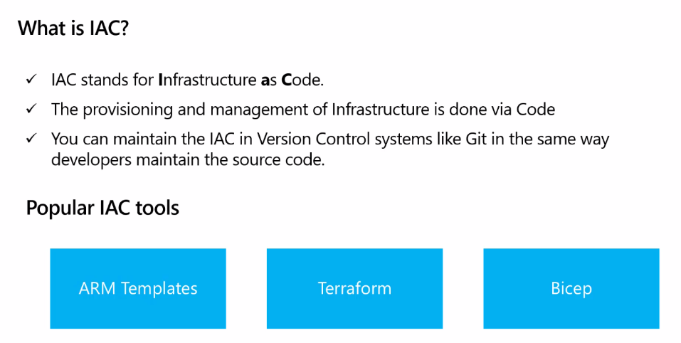
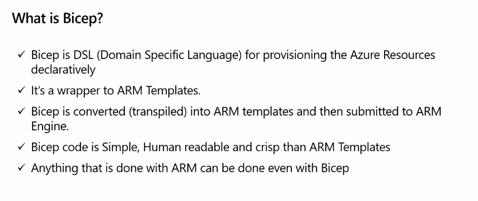
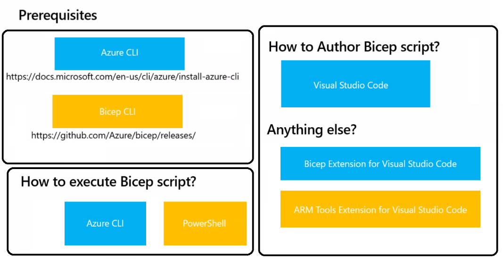
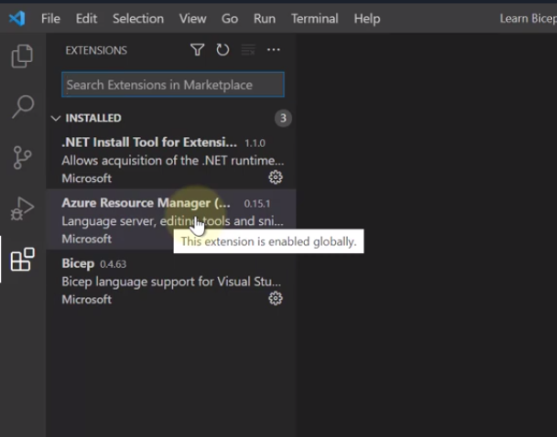
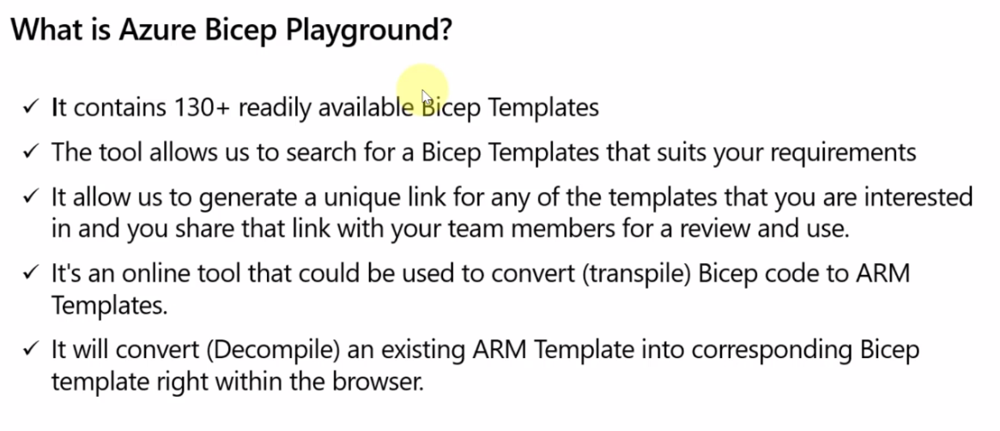
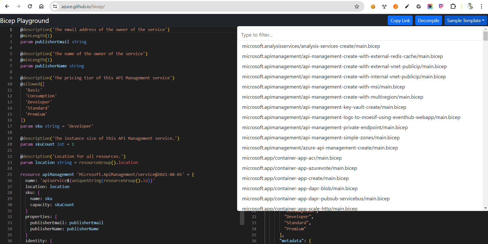
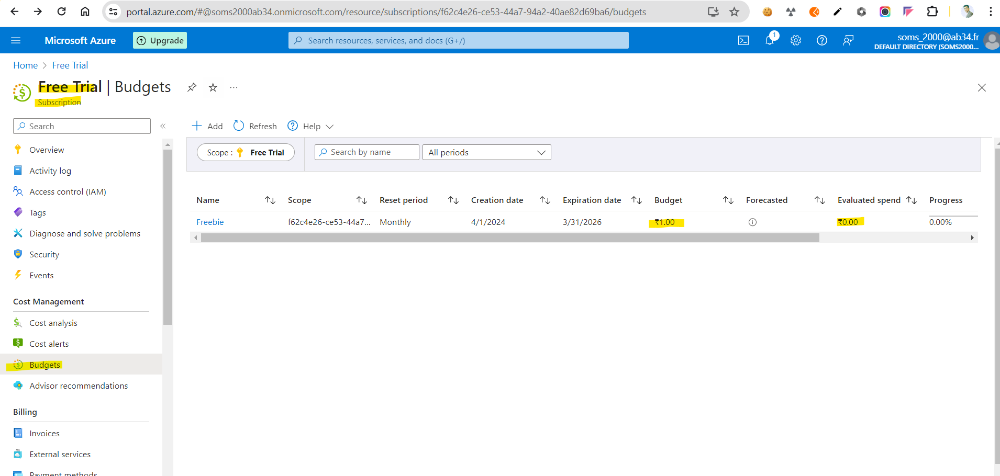

# azure-apim-bicep-demo
Managing infrastructure deployments on Azure as IaaC through Bicep scripts

# What is IaaC?

# What is Bicep?

# AZURE Bicep Setup Prerequisites

# AZURE Bicep Playground

# Must Set COST BUDGET ALERT to the SUBSCRIPTION

# AZURE PORTAL LOGIN using AZURE CLI
az login

# SET SUBSCRIPTION using AZURE CLI
az account set --subscription f62c4e26-ce53-44a7-94a2-40ae82d69ba6 

# CREATE RESOURCE GROUP in certain LOCATION using AZURE CLI
az group create --name <<<resource-group-name>>> --location eastus

# EXECUTE/SUBMIT ARMTEMPLATE.JSON file to AZURE ENGINE using AZURE CLI
aaz deployment group create --resource-group <<<resource-group>>> --template-file <<<armtemplatefile.json>>>

# EXECUTE/SUBMIT AZUREBICEPTEMPLATE.BICEP file to AZURE ENGINE using AZURE CLI
az deployment group create --resource-group <<<resource-group>>> --template-file <<<biceptemplatefile.bicep>>>